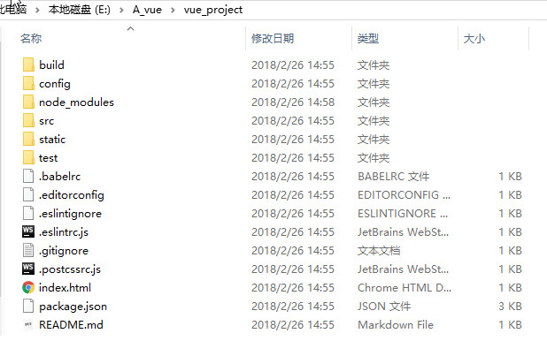

### vue学习记录

#### 2.26

1. 采用官方提供的命令行工具——vue-cli，搭建可直接用于生产环境的构建配置的项目。

   ​	输入命令行：

   ​		npm  install  --global  vue-cli 

   ​		vue  init  webpack  文件名（此处的webpack指此项目基于webpack模板，此处还需要选择一些构建配置项）

   ​		cd  文件名（进入该文件）

   ​		npm  run  dev 

   > 注意：执行完毕后即项目所需依赖安装完成，此时已经有完整的文件目录了，但是运行项目时（npm  run  dev）想要使浏览器自动打开，需要将config文件夹下的index.js中dev选项中的autoOpenBrowser值改为true（构建配置时默认为false）。

   ​	配置完成后，生成以下目录：

   

2. 目录结构说明

   ----- build		项目构建相关代码（webpack）

   ----- config		配置目录

   ----- node_modules 	npm加载的项目依赖模块

   ----- src			项目源码目录（具体开发时的操作目录）

   ​	----- assets		资源目录，如图片，css，字体等

   ​	----- component	组件目录

   ​	----- router		路由配置目录

   ​	----- App.vue		跟组件，即项目入口文件

   ​	----- main.js		入口js文件	

   ----- static		纯静态资源文件，放置不会变动的资源，直接被复制到最终的打包目录（默认是dist/static）下

   ----- test		测试文件目录

   ----- .xxx		各种配置文件

   ----- index.html	首页入口文件

   ----- package.json		项目配置文件

   ----- README.md		项目的说明文档

#### 2.27

> 根据vue官方文档内容学习

1. Vue实例

   new  Vue({ })

2. 模板语法

   * 插值表达式

     + 文本       {{ xxx }}  “Mustache”语法将数据解析为普通文本

     + 原始html        需要用`v-html`指令来解析

     + 属性            需要用`v-bind`来绑定

     + JavaScript表达式       在双花括号中支持表达式运算，如三目，api等 

       注意：只支持 单个表达式！

   * 指令

     + `v-text`、`v-html`、`v-show`、`v-if`、`v-else`、`v-else-if`
     + `v-for`    循环指令
       + <any  v-for="item  in  array/object/number/string">{{ item.xxx }}</any>
       + <any  v-for="(value,key)  in  集合">{{value，key}}</any>
       + <any  v-for="(value,key,index)  in  集合">{{值，键，索引}}</any>
       + 注意：
         + 可以用 of 代替 in。
         + 可以取整数，他将重复多次模板。
         + 可以利用带有 `v-for` 的 <template>渲染多个元素。
         + 在组件中使用`v-for` ，key是必须的。
     + `v-pre`
       + 跳过这个元素和它的子元素的编译过程，可以用来显示原始 Mustache 标签
     + `v-cloak`
       + 保持在元素上直到关联实例结束编译。和 CSS 规则如 `[v-cloak] { display: none }` 一起用时，这个指令可以隐藏未编译的 Mustache 标签直到实例准备完毕。
     + `v-once`
       + 只渲染元素和组件一次。随后的重新渲染，元素/组件及其所有的子节点将被视为静态内容并跳过，可以用于优化更新性能。
     + `v-on`
       + 缩写：@
       + 用法：绑定DOM事件或自定义事件（事件名称是参数形式）
       + 修饰符：.stop(停止冒泡)   .prevent(阻止默认行为)   .once(只触发一次)
     + `v-bind`
       + 缩写：:
       + 用法：动态地绑定一个或多个特性，或一个组件 prop 到表达式
       + 修饰符
     + `v-model`
       + 用法：在表单控件或者组件上创建双向绑定
       + 修饰符： .lazy(取代input监听change事件)   .number(字符串转数字)   .trim(过滤首尾空格)

3. 计算属性

   对于模版内复杂逻辑的表达式，都应该使用计算属性。计算属性在computed中，可以用 *vm.属性名* 来访问，值得注意的是计算属性是基于其自身依赖的值进行缓存的，即其依赖的的值未发生变化，计算属性就不会重新求值。

   ​	注意：计算属性默认只有getter，可以手动添加setter。eg：computed.html

4. 侦听器

   当需要在数据变化时执行异步或开销较大的操作时，使用watch最为合适。

#### 2.28

1. Class绑定

   + 对象（可用具体对象或计算属性）
   + 数组（数组中可以有三目表达式也可以嵌套对象）
   + 注意：class绑定用在自定义组件上时，则该class将被添加到该组件的根元素上面，且该元素上原有的class不会被覆盖，将共存。

2. Style绑定

   + 对象（可用具体对象或计算属性）

   - 数组

   - 多重值：从 2.3.0 起可以为 style 绑定中的属性提供一个包含多个值的数组，常用于提供多个带前缀的值，如：

     ​	

     这样写只会渲染数组中最后一个被浏览器支持的值。在本例中，如果浏览器支持不带浏览器前缀的 flexbox，那么就只会渲染 `display: flex`

3. 条件渲染

   + `v-if`

     注意：

      + 若想使用其渲染分组，可以用<template>元素包裹，渲染结果将不包括<template>元素
     + `v-else-if` 必须在` v-if `后，而` v-else `必须在` v-if` 和` v-else-if `后。
     + 用 key 管理可复用元素
       + Vue 会尽可能高效地渲染元素，通常会复用已有元素而不是从头开始渲染，当状态切换时，页面上已有的元素将不再重新渲染，故可以保留用户已输入的信息。
       + 若不想要复用，则只需要添加一个具有唯一值的 key 属性即可，此时添加了 key 属性的元素在状态改变时将会被重新渲染。
     + `v-if` 确保在切换过程中条件块内的事件监听器和子组件适当的被销毁和重建，故其具有更高的切换开销
     + `v-for `的优先级高于` v-if `，这就意味着`v-if `将分别重复的运行域每个 `v-for` 循环中，这样就可以在遍历完成后再进行是否渲染的判断；若想要有条件的跳过循环的执行，则可以将` v-if `写在外层元素或<template>上。

   + `v-show `

     注意：

      + 带有` v-show `的元素始终会被渲染并保留在DOM中，故其具有更高的初始渲染开销，它只是在切换元素的CSS属性display的值。
      + `v-show` 不支持<template>元素

4. 列表渲染

   + `v-for` 

     注意：

      + 用` v-for `正在更新已渲染过的元素列表时，它默认用“就地复用”策略。如果数据项的顺序被改变，Vue 将不会移动 DOM 元素来匹配数据项的顺序， 而是简单复用此处每个元素，并且确保它在特定索引下显示已被渲染过的每个元素。为了给 Vue 一个提示，以便它能跟踪每个节点的身份，从而重用和重新排序现有元素，你需要为每项提供一个唯一 key 属性
         + 

   + 更新检测

     + 数组

       + 注意：由于 JavaScript 的限制，Vue 不能检测数组用索引直接设置的项和修改数组长度，应该使用如下：

         ​	Vue.set(数组, 键, 新值)

     + 对象

       + 注意：还是由于 JavaScript 的限制，Vue 不能检测对象属性的添加或删除，故应如下：

         ​	Vue.set(object, key, value)

         还可以使用 `vm.$set` 实例方法，它只是全局 `Vue.set` 的别名。

5. 事件处理

   + 监听事件绑定

     <button  v-on:click="say"></button>

     <button  v-on:click="say(param)"></button>  此处param为回调函数参数

     <button  v-on:click="say(param,$event)"></button>   此处$event为原始的 DOM 事件

   + 事件修饰符

     + .stop
     + .prevent        
     + .capture        添加事件侦听器时使用 capture 模式。
     + .self          只当事件是从侦听器绑定的元素本身触发时才触发回调。
     + .once          只触发一次回调。
     + .passive         以 `{ passive: true }` 模式添加侦听器

   + 按键修饰符

     + <input v-on:keyup.13="submit">

       只有在 keyCode 是 13 时调用 `vm.submit()`

     + <input @keyup.enter="submit">

     + 按键别名：

       + .enter
       + .tab
       + .delete
       + .esc
       + .space
       + .up
       + .down
       + left
       + right

     + 可以通过全局 config.keyCodes 对象自定义按键修饰符别名，如：

       Vue.config.keyCodes.f1 = 112 ，此时可以使用 v-on:keyup.f1

   + 系统修饰键

     + 仅在按下相应按键时才触发鼠标或键盘事件的监听器

       + .ctrl
       + .alt
       + .shift
       + .meta（Windows下是⊞，Mac下是⌘）

     + .exact        精准的控制系统修饰符组合触发的事件

       + 即使 Alt 或 Shift 被一同按下时也会触发

         <button @click.ctrl="onClick">A</button>

       + 有且只有 Ctrl 被按下的时候才触发

         <button @click.ctrl.exact="onCtrlClick">A</button>

       + 没有任何系统修饰符被按下的时候才触发

         <button @click.exact="onClick">A</button>

     + 鼠标按钮修饰符（限制处理函数仅响应特定的鼠标按钮）

       + .left
       + .right
       + .middle

6. 表单输入的绑定

   + 基础用法
     + input（text、checkbox、radio）、textarea、select
     + 注意： 
       + 在文本区域插值 (`<textarea></textarea>`) 并不会生效，应用 `v-model` 来代替。
       + `v-model` 会忽略所有表单元素的 value、checked、selected 特性的初始值而总是将 Vue 实例的数据作为数据来源，故应该通过 Js在组件的 `data`选项中声明初始值。
   + 值绑定
     + 对于单选按钮，复选框及选择框的选项，`v-model` 绑定的值通常是静态字符串 (对于复选框也可以是布尔值)，若是想要把值绑定到Vue实例的一个动态属性上，可以用 `v-bind` 实现，且这个动态属性的值可以不是字符串。
   + 修饰符
     + .lazy
     + .number
     + .trim
   + 在组件上使用 `v-model`

#### 3.1

1. 组件

   1. 所有的 Vue 组件同时也都是 Vue 的实例，所以可接受相同的选项对象 (除了一些根级特有的选项) 并提供相同的生命周期钩子。

   2. 使用组件

      + 全局注册

        + Vue.component( tagName, options )
        + 组件在注册后，便可以作为自定义元素在一个实例的模板中使用。注意：在初始化实例之前注册组件。

      + 局部注册

        + new  Vue({

          ​	...

          ​	// 注意：选项名为components（加 s）

          ​	components: {

          ​		// 注意：其中注册的组件将只能在父组件模板中可用

          ​		'part-component': { template: “<h1>我是局部注册的组件</h1> ”}

          ​	}

          })

   3. DOM解析注意事项

      + 受HTML本身的一些限制，导致自定义组件在一些元素中无效，如：<ul><table><select>等，解决方法：使用is特性

   4. data必须是函数（数据放在返回值return中）

      + 构造 Vue 实例时传入的各种选项大多数都可以在组件里使用。只有一个例外——data 必须是函数：

        ​	Vue.component({

        ​		...

        ​		data: function(){

        ​			return  {

        ​				info: 'xxx',

        ​				message: 'xxx'

        ​			}

        ​		}

        ​	});

   5. props down,event up（pass props,emit event）

2. Prop

   1. 组件实例的作用域是孤立的。故子组件不能在其模版内直接引用父组件的数据，父组件的数据要通过props下发到子组件中。

      ​	Vue.component( 'child' , {

      ​		props: [ 'vueMessage' ],

      ​		template: "
{{ vueMessage }}
"

      ​	} )

      调用：<child message="hello"></child>

      + 注意：HTML特性不区分大小写。故父组件在传值时需要将props中的值改为 **短横线分格式命名** 

   2. 动态prop

      + 可以用 `v-bind` 来动态的将 prop 绑定到父组件的数据

        ​	<child  v-bind:my-message="info"></child>

      + 也可以将一个对象(todo)的所有属性作为prop传递（此时 `v-bind` 不带参数）

        ​	<child  v-bind="todo"></child>

   3. 单项数据流

      + prop是单向绑定的，故在子组件内部修改prop不会改变父组件中的数据而且vue会发出警告。所以想要将prop值当作局部数据来用 或是 将其处理成其他数据输出，应该用prop值去初始化一个局部变量 或是 定义一个计算属性并将其值处理后返回。
      + 注意：在 JavaScript 中对象和数组是引用类型，指向同一个内存空间，如果 prop 是一个对象或数组，在子组件内部改变它会影响父组件的状态

   4. prop验证

      + 此时prop选项需要用对象来定义，而不能用数组
      + 注意：若验证propA时，需写成prop-a而不能写成propA

3. 非Prop特性

   + 可直接传入组件，不需要定义相应的prop，且自动添加到子元素的根元素上
   + 替换/合并现有属性
     + 对于多数特性来说，传入的值会覆盖组件本身设定的值，如 type、title等；但对于class和style特性，其值会合并。

4. 自定义事件

   1. 使用 `v-on` 绑定自定义事件

      + 每个 Vue 实例都实现了 事件接口，即：
        + $on( eventName ) 监听事件
        + $emit( eventName ) 触发时间
        + 注意：`$on`  和 `$emit` 并不是 addEventListener 和 dispatchEvent 的别名。
      + 父组件可以在使用子组件的地方直接用 `v-on` 来监听子组件触发的事件。

   2. 给组件绑定原生事件

      + .native

        <my-component  v-on:click.native="doTheThing"></my-component>

   3. 使用自定义事件的表单输入组件

      + 表单输入组件的数据双向绑定：

        <input  v-model="something">

        以上是以下写法的语法糖，

        <input  v-bind:value="something"  v-on:input="something = $event.target.value">

        在组件中使用时，相当于：

        <input  v-bind:value="something"  v-on:input="something = arguments[0]">

        故 要让组件的 `v-model` 生效，他应该接受一个 value prop 和 在有新的值时触发 input 事件并将新值作为参数。

   4. 自定义组件的 `v-model`

      + 默认情况下，一个组件的 `v-model` 会使用 value prop 和 input 事件。但是诸如单选框、复选框之类的输入类型可能会把 value 用做了别的目的。model 选项可以避免这样的冲突：

        Vue.component( 'my-checkbox' , {

        ​	model : {

        ​		prop : 'checked',

        ​		event : 'change'

        ​	},

        ​	props : {

        ​		checked : Boolean,       // 任然需要显式的声明

        ​		value : String          // 这样就拿到value这个prop了

        ​	}

        })

        绑定：

        <my-checkbox  v-model="foo"  value="some value"></my-checkbox>

        上述代码等价于：

        <my-checkbox  :checked="foo"  @change="val => { foo = val }"  value="some value"></my-checkbox>	

5. 使用插槽分发内容

   1. 编译作用域
      + 注意：父组件模板内容在父组件作用域内编译，子组件模板内容在子组件作用域内编译
   2. 单个插槽
      + 在子组件中的 <slot> 标签中的内容为备用内容。备用内容在子组件的作用域内编译，并且只有在宿主元素为空，且没有要插入的内容时才显示备用内容。
      + 除非子组件模板包含至少一个 <slot> 插口，否则父组件的内容将会被丢弃
      + 当子组件模板只有一个没有属性的插槽时，父组件传入的整个内容片段将插入到插槽所在的 DOM 位置，并替换掉插槽标签本身。
   3. 具名插槽
      + <slot> 元素可以用 name 来进一步配置如何分发内容，多个插槽有不同的名字，将匹配内容片段中对应的 slot 特性的元素。
      + 若有匿名插槽（既没有 name 属性），则为默认插槽，作为找不到匹配内容的片段的备用插槽。
   4. 作用域插槽
      + 一种特殊类型的插槽，用作一个 (能被传递数据的) 可重用模板，来代替已经渲染好的元素。
      + 在父级中，具有特殊特性 slot-scope 的 <template> 元素必须存在，表示它是作用域插槽的模板。slot-scope 的值将被用作一个临时变量名，此变量接收从子组件传递过来的 prop 对象
      + 在 2.5.0+，slot-scope 能被用在任意元素或组件中而不再局限于 <template>。

6. 动态组件

   + 通过使用保留的 <component> 元素，并对其 is 特性进行动态绑定，可以在同一个挂载点动态切换多个组件，若想把切换出去的组件保留在内存中，保留它的状态或避免重新渲染，可为此添加一个keep-alive指令参数：

     ​	<keep-alive>

     ​		<component  :is="current">

      			<!-- 非活动组件将被缓存 -->

     ​		</component>

     ​	</keep-alive>

7. 杂项

#### 3.2

1. 组件间的通信

   1. ​

   ​

2. 路由

   1. 路由导航（默认被渲染成一个<a>标签）：

      <router-link  to="/list">Go To List</router-link>

      "to"：指定跳转链接

   2. 路由出口（渲染的地方）：

      <router-view></router-view>

   3. 定义路由

      const  routes  =  [

      ​	{ path: '/list', component: List },

      ​	{ path: '/bar', component: Bar }

      ]

      + 每个路由都映射一个组件（component后是组件名称）。

   4. 创建 router 实例

      const  router  =  new  VueRouter({

      ​	routes        // routes的配置项，此处为缩写，相当于 routes: routes

      });

   5. 挂载到根实例上

      const  app  =  new  Vue({

      ​	router

      }).$mount( '#app' );

   6. 路由访问

      this.$router.params

      this.$router.go(-1);

      this.$router.push(url);

3. 路由嵌套

   const  router  =  new VueRouter({
     routes: [
   ​    { path: '/user/:id', component: User,
   ​      children: [
   ​        {
   ​          // 当 /user/:id/profile 匹配成功
   ​          path: 'profile',
   ​          component: UserProfile
   ​        },
   ​        {
   ​          // 当 /user/:id/posts 匹配成功
   ​          path: 'posts',
   ​          component: UserPosts
   ​        }
   ​      ]
   ​    }
     ]
   })

   + 注意，以 / 开头的嵌套路径会被当作根路径。

4. 重定向 和 别名

   1. 重定向

      redirect:  string/object/function

      - 即 当访问 ‘/list’ 时url会被(替换)重新定向到 ‘/detail’，然后再匹配路由为‘/detail’

        routes: [

        ​	{ path: '/list', redirect: '/detail' }

        ]

   2. 别名

      alias: string

      + 即‘/detail’的别名为‘/list’， 当访问 ‘/list’ 时，url会保持为 ‘/list’，但路由匹配为'/detail'，即访问的实际上是 ‘/detail’

#### 3.5

1. 过渡&动画

   1. 列表过渡

      1. 单元素/组件的过渡

         + <transition  name="fade"><transition>

         + class切换

           1. fade-enter : 定义进入过渡的开始状态。在元素被插入时生效，在下一个帧移除。
           2. fade-enter-active : 定义过渡的状态。在元素整个过渡过程中作用，在元素被插入时生效，在transition/animate完成之后移除。这个类可以被用来定义过渡的过程时间，延迟和曲线函数。
           3. fade-enter-to : 定义进入过渡的结束状态。在元素被插入一帧后生效（与此同时 fade-enter 被删除），在 transition/animate 完成之后移除。
           4. fade-leave : 定义离开过渡的开始状态。在离开过渡被触发时生效，在下一个帧移除。
           5. fade-leave-active : 定义过渡的状态。在元素整个过渡过程中作用，在离开过渡被触发后立即生效，在 transition/animate 完成之后移除。这个类可以被用来定义过渡的过程时间，延迟和曲线函数。
           6. fade-leave-to : 定义离开过渡的结束状态。在离开过渡被触发一帧后生效（与此同时 fade-leave 被删除），在 transition/animate 完成之后移除。

         + 自定义过渡类名

           1. enter-class

           2. enter-active-class

           3. enter-to-class

           4. leave-class

           5. leave-active-class

           6. leave-to-class

              他们的优先级高于普通类名。

         + 同时使用过渡和动画

         + 显性的过渡持续时间

         + JavaScript钩子

           + <transition
               v-on:before-enter="beforeEnter"
               v-on:enter="enter"
               v-on:after-enter="afterEnter"
               v-on:enter-cancelled="enterCancelled"

               v-on:before-leave="beforeLeave"
               v-on:leave="leave"
               v-on:after-leave="afterLeave"
               v-on:leave-cancelled="leaveCancelled" >

             </transition>

           + methods : {

             ​	beforeEnter : function( el ){ },

             ​	enter : function( el, done ){ done() },

             ​	afterEnter : function( el ){ },

             ​	enterCancelled : function( el ){ },

             ​	beforeLeave : function( el ){ },

             ​	leave : function( el, done ){ },

             ​	afterLeave : function( el ){ },

             ​	leaveCancelled : function( el ){ }	// leaveCancelled只能用于 v-show 中

             }	

             注意： 在 enter 和leave 中，回调函数 done 是必须的。否则，他们会被同步调用，过渡会立即完成。

             推荐：仅使用 JavaScript 过渡的元素添加 `v-bind:css="false"`，Vue 会跳过 CSS 的检测。这也可以避免过渡过程中 CSS 的影响。

      2. 初始渲染的过渡

         + 通过 appear 特性设置节点在初始渲染的过渡。

           <transition  appear></transition>

         + 自定义类名

           + appear-class
           + appear-to-class
           + appear-active-class

         + JavaScript钩子

           + <transition

             ​	appear

             ​	v-on:before-appear="xxx"

             ​	v-on:appear="xxx"

             ​	v-on:after-appear="xxx"

             ​	v-on:appear-cancelled="xxx" >

             </transition>

      3. 多个元素的过渡

         + 原生标签可以使用 `v-if`/`v-else` 。

           + 当有相同标签名的元素切换时，需要通过 key 特性设置唯一的值来标记以让Vue区分它们，否则Vue为了效率只会替换相同的标签内部的内容。即使在技术上没有必要，给在 <transition> 组件中的多个元素设置 key 是一个更好的实践！

           + 有时，可以通过给一个元素的 key 特性设置不同的状态来代替 `v-if` 和 `v-else` 

             + <transition>

               ​	<button v-bind:key="isEdit">

               ​		{{ isEdit ? 'Save' : 'Edit' }}

               ​	</button>

               </transition>

             + <transition>

               ​	<button v-bind:key="docState">

               ​		{{ btnMessage }}

               ​	</button>

               </transition>

               // ....

               computed : {

               ​	btnMessage : function( ){

               ​		switch ( this.docState ) {

               ​			case  'aaa' : return  'AAA',

               ​			case  'bbb' : return  BBB',

               ​			case  'ccc' : return  'CCC'

               ​		}

               ​	}

               }

         + 过渡模式

           + <transition>的默认行为：进入和离开同时发生。
           + Vue提供了 过渡模式
             + in-out：新元素先进行过渡，完成后当前元素过渡离开
             + out-in：当前元素先进行过渡，完成后新元素过渡进入

      4. 多个组件的过渡

         + 不需要使用 key 特性，只需要使用 动态组件

      5. 列表过渡

         + <transition-group> 组件
           + 他会以一个真实的元素呈现：默认为一个  （可以通过 tag 特性更换为其他元素）。
           + 内部元素总是需要提供唯一的 key 属性值
         + 列表的进入/离开过渡
         + 列表的排序过度
           + 新增 `v-move` 特性，在元素改变定位的过程中应用。（同样：通过 name 属性来自定义前缀，也可以通过 move-class 属性手动设置。）`v-move` 对于设置过渡的切换时机和过渡曲线非常有用。
           + Vue的内部实现是使用了 FLIP 简单的动画队列使用transforms 将元素从之前的位置平滑过渡新的位置。
           + 注意： 使用FLIP过渡的元素不能设置为 display : inline。作为代替方案，可以设置 display : inline-block 或者放置于 flex 中。

      6. 可复用的过渡

         + 过渡可以通过Vue的组件系统实现复用。要创建一个可复用过渡组件，只要将 <transition> 或者 <transition-group> 作为根组件，再将子组件放置在其中即可。

      7. 动态过渡

   2. 状态过渡

      1. 状态动画 与 侦听器
      2. 动态状态过度
      3. 把过渡放到组件里
      4. 图片动画
         + SVG的本质是数据

#### 3.6

1. 混入

   1. 概念
      + 混入 是一种分发 Vue 组件中可复用功能的非常灵活的方式。混入对象可以包含任意组件选项。当组件使用混入对象时，所有混入对象的选项将被混入该组件本身的选项。
   2. 选项合并
      + 当组件和混入对象含同名选项时，这些选项回合并
        + 数据对象在内部会进行浅合并（一层属性深度），在组件的数据发生冲突时以组件数据优先。
        + 同名的钩子函数将混合为一个数组，因此都将被调用。另外，混入对象的钩子将在组件自身钩子 之前 调用。
        + 值为对象的选项，如：methods，components和directive，将被混合成同一个对象。两个对象键名冲突时，以组建对象的键值对优先。
        + 注意：Vue.extend() 也使用同样的策略进行合并。
   3. 全局混入
      + 也可以全局注册混入对象。但是一旦使用全局混入对象，将会影响到所有之后创建的 Vue 实例。使用恰当时，可以为自定义对象注入处理逻辑。
      + 谨慎使用全局混入对象，因为会影响到每个单独创建的 Vue 实例 (包括第三方模板)。大多数情况下，只应当应用于自定义选项。也可以将其用作 Plugins 以避免产生重复应用。
   4. 自定义选项合并策略
      + 自定义选项将使用默认策略，即简单地覆盖已有值。
      + 自定义逻辑合并......

2. 自定义指令

   1. 简介

      - Vue允许自定义指令

        - 注册全局自定义指令 

          Vue.directive( 'focus' , { 

          ​	inserted : function ( el ) {

          ​		el.focus();

          ​	}

          })

        - 注册局部自定义指令

          directive : {

          ​	focus : {

          ​		inserted : function ( el ) {

          ​			el.focus();

          ​		}

          ​	}

          }

        - 使用自定义指令

          <input  v-focus>

   2. 钩子函数

      1. bind : 只调用一次，指令第一次绑定到元素时调用。即初始化设置。
      2. inserted : 被绑定元素插入父节点时调用（仅保证父节点存在，但不一定已被插入文档中）。
      3. update : 所在组件的 VNode 更时调用，但是可能发生在其子 VNode 更新之前。指令的值可能发生了改变，也可能没有。
      4. componentUpdated : 指令所在组件的 VNode 及其子 VNode 全部更新后调用。
      5. unbind : 只调用一次，指令与元素解绑时调用。

   3. 钩子函数参数

      1. el : 指令所绑定的元素，可以用来直接操作 DOM。
      2. binding : 一个对象，包含以下的属性：
         1. name : 指令名，不包含 v- 前缀。
         2. value : 指令的绑定值，例如在 v-my-directive="1+1"中，绑定值为2。
         3. oldValue : 指令绑定的前一个值，仅在 update 和 componentUpdated 钩子中可用（无论值是否改变都可用）。
         4. expression : 字符串形式的指令表达式，例如在 v-my-directive="1 + 1" 中，表达式为"1 + 1"。
         5. arg : 传给指令的参数，可选。例如在 v-my-directive:foo 中，参数为 "foo"。
         6. modifiers : 一个包含修饰符的对象。例如在 v-my-directive.foo.bar 中，修饰符对象为 { foo: true, bar: true }。
      3. vnode : Vue 编译生成的虚拟节点。
      4. oldVnode : 上一个虚拟节点，仅在 update 和 componentUpdated 钩子中可用。

      + 注意：除 el 之外，其他参数都应该是只读的，切勿进行修改。若需要在钩子函数之间共享数据，建议通过元素的 dataset 来进行。

   4. 函数简写

      + 有时，若想要在 bind 和 update 时触发相同的行为，而不关心其他的钩子，可以简写为：

        Vue.directive( 'color-swatch' , function ( el , binding ) {

        ​	el.style.backgroundColor = binding.value

        })

   5. 对象字面量

      + 若果指令需要多个值，可以传入一个 JavaScript 对象字面量（指令函数能够接受所有合法的 JavaScript 表达式）。

        

        Vue.directive( '' , function ( el, binding ) {

        ​	console.log( binding.value.color );

        });

3. 渲染函数&JSX 

4. ​

Tween.js       一款可生成平滑动画效果的js动画库

Color.js

Lodash.js

velocity.js